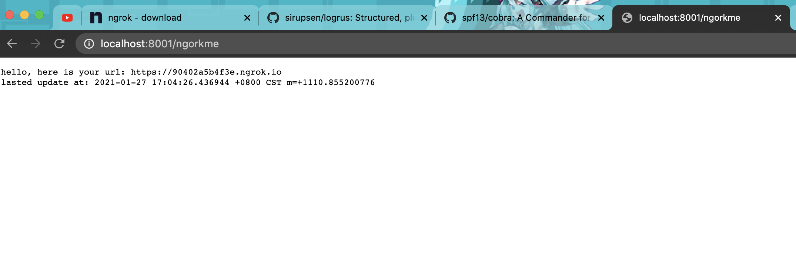

# ngrok Restarter

In a private network environment. We need use ngrok to export our services public of the network.
but the free version of ngrok, you have to restart it every 2 hours. it's headache. so i made this for help restart it every 2 hours.
then post current public url into somewhere (server mode program of this project).

## Preparation

* gov.1.12 above required.
* `go mod vendor && go build`
* please download current version of [ngrok](https://ngrok.com/download) & decompose it on current working directory.

## Start server
`ngrok_restarter -m server`


* open [here](http://0.0.0.0:8001/ngorkme)

## Start client
`./check_ngork.sh`

## work around
Seems ngrok had some protect mechanism. when kill ngrok process need to quite parent process first.
>> we use `crontab` to solve this issue!

```
0 */2 * * * cd $WORKDIR/ngrok_restarter && ./check_ngork.sh > crond.log &
```
* execute job every 2 hours
